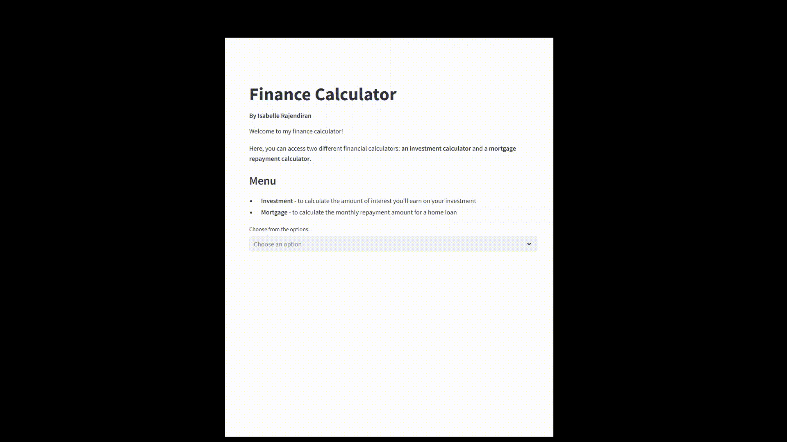

# Finance Calculator 📊

## Table of Contents
1. [Project Description](#project-description)
2. [Requirements](#requirements)
3. [Installation](#installation)
4. [Usage](#usage)
5. [Acknowledgments](#acknowledgement)

## Project Description

In this project, a simple streamlit app was created for performing financial calculations, including:
- **Mortgage Calculator**: Calculate monthly repayments for a home loan.
- **Investment Calculator**: Calculate future investment returns based on simple or compound interest.

This app was designed with an intuitive and user-friendly interface to help users make informed financial decisions with ease.

## Requirements
To run this app, you will need the following:
- `Python`
- Required dependencies (downloaded during installation)
  - `streamlit==1.41.1`
    
## Installation
The app can be run either locally or using the web-browser.

**To run this app locally, follow these steps:**
1. Open your terminal/command prompt.
2. Navigate to your desired directory.
3. Git clone this repository:
   ```bash
   git clone https://github.com/IsabelleRaj/Finance-Calculator
   ```
4. Install the required dependencies:
   ```bash
   pip install -r requirements.txt
   ```
5. Launch the streamlit app:
   ```bash
   streamlit run streamlit_calc_app.py
   ```

**To launch the deployed app:**
1. Visit this link: [Streamlit Finance Calculator](https://finance-calculator-isabelleraj.streamlit.app/)

## 2. Usage
Here are the features of this app:
- **Mortgage Calculator**:
  - Enter the loan amount, yearly interest rate, and repayment period.
  - Calculates monthly repayments instantly.
- **Investment Calculator**:
  - Enter the deposit amount, yearly interest rate, and time period.
  - Choose between simple and compound interest.
  - Calculates the total amount at the end of the investment period.
 
Here is a quick demo example:



## 3. Acknowledgments
This project was written by me ([@IsabelleRaj](https://github.com/IsabelleRaj)).
